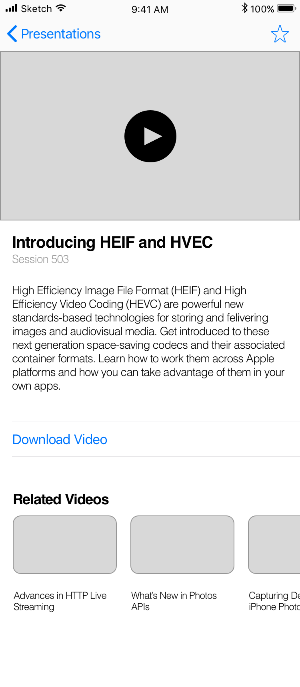

# ios-architecture-mvc


Motivation
---
The goal of this repository is to provide a ~~state of the art~~ model implementation, that leverages the power of MVC architecture. The implementation will be inspired by [A Better MVC](https://davedelong.com/blog/2017/11/06/a-better-mvc-part-1-the-problems/) posts and publicly available Apple documentation.


# Table of Contents
1. [User Stories](#user-stories)
2. [UI](#ui)

## User Stories

```
AS User
I WOULD LIKE TO consult a list of presentations
SO THAT I'll be able to get an ideea of what is available to download.
```
```
AS User
I WOULD LIKE TO have a download shortcut on the list
SO THAT I'll be able to download a presentation on the fly.
```
```
AS User
I WOULD LIKE TO access a presentation details
SO THAT I'll be able to consult more information about it.
```
```
AS User
I WOULD LIKE TO access a presentation video content
SO THAT I'll be able to watch its content.
```
```
AS User
I WOULD LIKE TO mark a presentation as favorite from details page
SO THAT I'll be able to spot the ones I'm interested in most in the list.
```
```
AS User
I WOULD LIKE TO download a video from details page
SO THAT I'll be able to watch it later.
```
```
AS User
I WOULD LIKE TO consult related presentation
SO THAT I'll be able to learn more on the same topic.
```


## UI

| List View  | Details View |
| ------------- | ------------- |
|  |  |


